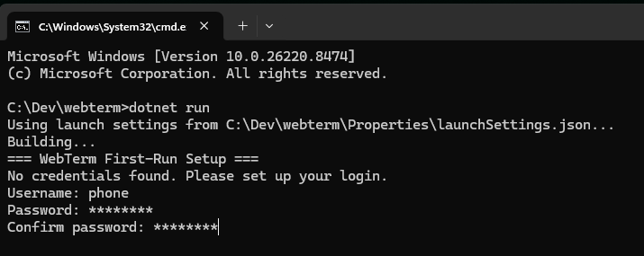
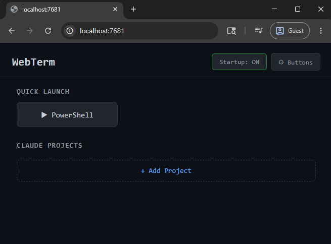
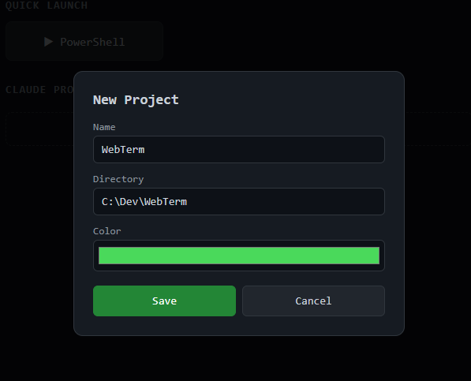
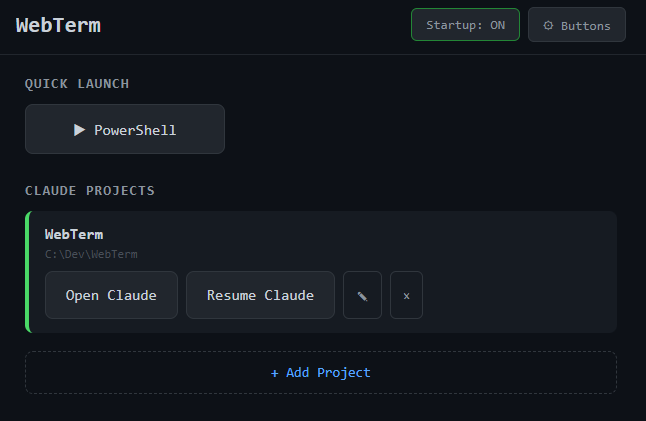
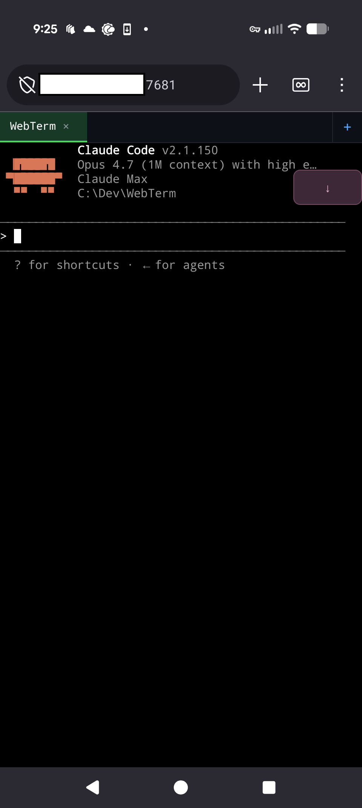
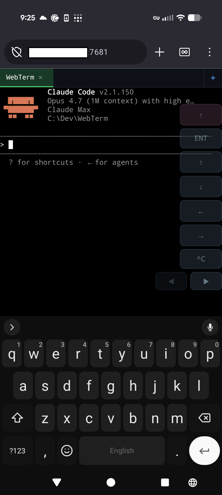

# WebTerm

Browser-based terminal over WebSocket with persistent, multi-tab sessions. Built for running [Claude Code](https://docs.anthropic.com/en/docs/claude-code) from any device — including mobile.

ASP.NET Core minimal API backend + xterm.js frontend. Connects your browser to a real PTY (pseudo-terminal) on the host machine.

## Features

- **Persistent sessions** — PTY stays alive through disconnects, screen sleep, network loss. Reconnect and pick up where you left off.
- **Multi-tab** — run multiple shells or Claude Code instances side by side with a tabbed interface.
- **Claude Code integration** — launch Claude Code directly into any configured project directory. Open new or resume existing sessions.
- **Mobile-friendly** — touch-optimized button overlay with configurable keys (Enter, arrows, Ctrl combos, Esc, Tab, etc.) and paginated layout.
- **Native text input** — uses a virtual text entry layer that preserves your device's autocomplete, swipe typing, dictation, and IME support. Edits are transparently bridged to the PTY, so the full mobile keyboard experience works naturally in the terminal.
- **Session ring buffer** — 256KB buffer replays recent output on reconnect so you never lose context.
- **Server-sourced session registry** — tab state lives on the server, not in localStorage. Any browser connecting sees all active sessions. Cross-device by default.
- **Real-time tab sync via SSE** — Server-Sent Events push `tab_opened` / `tab_closed` notifications to all connected browsers instantly (MCP-created tabs, cross-device opens, idle reaps).
- **Tab attention notifications** — Claude Code hooks notify WebTerm when Claude needs approval or finishes. Tab bar shows attention indicators, the page title flashes, and browser push notifications fire when you're not looking. Auto-configured during MCP setup.
- **MCP server** — built-in [Model Context Protocol](https://modelcontextprotocol.io/) endpoint at `/mcp`. Tools: `open_tab`, `close_tab`, `list_tabs`. Lets Claude Code (or any MCP client) open and manage terminal tabs programmatically. One-click setup from the main screen.
- **Basic auth** — credentials set on first run, encrypted with Windows DPAPI.
- **Startup toggle** — optional Windows startup registration from the main screen.
- **Configurable buttons** — reorder built-in buttons, switch Claude model/effort, and create custom buttons that send any text to the terminal. Custom buttons can trigger slash commands (e.g. `/review`), full prompts (e.g. `summarize all changes, commit, and create a pull request`), or any terminal input.

## Screenshots

### First Run Setup
Set username and password on first launch via console prompt.



### Main Menu
Quick launch PowerShell or manage Claude Code projects.



### Add Project
Configure a project with a name, directory, and color.



### Project Configured
Launch or resume Claude Code sessions per project.



### Mobile — Terminal Session
Full terminal access from a phone browser.



### Mobile — Expanded Buttons
Paginated button overlay for touch input — arrow keys, Ctrl combos, Enter, and more.



## Requirements

- Windows (uses `powershell.exe` and Windows DPAPI for credential storage)
- [.NET 10 SDK](https://dotnet.microsoft.com/download/dotnet/10.0)

## Getting Started

```bash
git clone https://github.com/HalfLucid/Claude-Code-Cli-WebTerminal.git
cd Claude-Code-Cli-WebTerminal
dotnet run
```

On first run you'll be prompted to set a username and password. After setup, the browser opens automatically to `http://localhost:7681`.

## Usage

1. **PowerShell** — click "PowerShell" on the main screen to open a shell tab
2. **Claude Code** — add a project (name + directory), then use "Open Claude" or "Resume Claude"
3. **Tabs** — use the `+` button to open more sessions, click tabs to switch
4. **Mobile** — tap the arrow button on the right edge to expand the button overlay for touch-friendly input
5. **Remote access** — access from other devices on your network at `http://<your-ip>:7681` (works great with Tailscale)

## Custom Buttons

The button overlay on the right side is fully configurable via the **Buttons** settings on the main screen.

- **Reorder** — move any built-in button up or down to change its position
- **Model / Effort** — built-in popout buttons to switch Claude's model (`opus`, `sonnet`, `haiku`) or effort level
- **Custom buttons** — add your own buttons with a label and a command string

Custom button commands are sent directly to the terminal as text input, so they work with anything the active shell or CLI accepts. Examples:

| Label | Command | What it does |
|-------|---------|--------------|
| Review | `/review` | Triggers Claude Code's review skill |
| Compact | `/compact` | Compresses Claude Code context |
| Commit | `summarize all changes, commit, and create a pull request` | Full natural language prompt sent to Claude Code |
| Status | `git status` | Runs a git command in a PowerShell tab |

Buttons and their order are persisted in `webterm-settings.json` and shared across all sessions.

## MCP Integration

WebTerm includes a built-in [MCP](https://modelcontextprotocol.io/) server that lets Claude Code open, close, and list terminal tabs programmatically.

**Setup:**

1. Click the **MCP** button on the main screen
2. A PowerShell tab opens with the `claude mcp add` command pre-filled — press Enter to register it
3. Claude Code can now manage your WebTerm tabs via MCP tools

MCP setup also installs Claude Code hooks that send tab attention notifications (permission requests, task completion) back to the browser.

**Available tools:**

| Tool | Description |
|------|-------------|
| `open_tab` | Open a new terminal tab (PowerShell, Claude, or Claude resume). Optionally specify a project, label, or command to run on launch. |
| `close_tab` | Close a tab by session ID |
| `list_tabs` | List all active sessions with metadata |

Auth uses a DPAPI-encrypted API key (separate from Basic auth), passed via `?token=` query parameter.

## Publishing

```bash
dotnet publish -c Release
```

The published app listens on `http://0.0.0.0:7681` on all interfaces.

## License

[MIT](LICENSE.txt)
